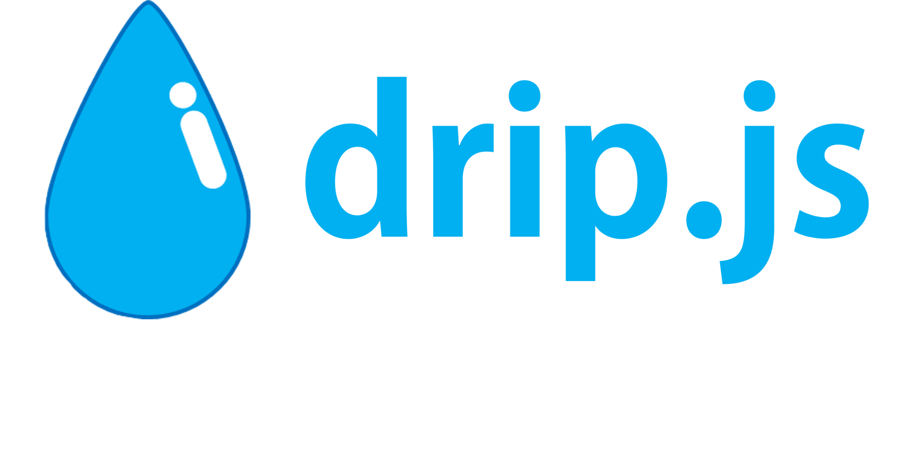

<p align="center">
  
</p>
<p align="center">A progressive Node.js Open source quantitative framework for building efficient and scalable quantitative trading applications</p>
<p align="center">
<a href="https://www.npmjs.com/package/dripjs">
<a href="https://www.npmjs.com/package/dripjs"></a>`
<a href="https://www.npmjs.com/package/dripjs"></a>
<a href="https://travis-ci.com/zlq4863947/dripjs"></a>
<a href="https://coveralls.io/github/zlq4863947/dripjs?branch=master"></a>
<a href="https://gitter.im/drip-js/community?utm_source=badge&utm_medium=badge&utm_campaign=pr-badge&utm_content=badge"></a>
<a href="https://www.paypal.me/zlq4863947"></a>
</p>

# Introduction

查看<a href="https://github.com/zlq4863947/dripjs/blob/master/README.md">中文</a>

**Drip.js** aims to provide an out-of-the-box quantitative trading program architecture allows developers to easily create highly available, scalable, and easy to maintain quantitative trading applications.

## Philosophy

Let quantitative developers spend most of their energy and time at the core: the development of trading strategies.
**Drip.js** provides everything else, so developers no longer have to worry about re-creating wheels

## Install

This framework is fully modular, you can install it into your program using the following command

```shell
npm install dripjs
```

If you only want to use a submodule in the framework

```shell
npm install dripjs-bitmex
```

## Use

```typescript
import { IntelligenceFactory } from 'dripjs';

const pair = 'XBTUSD';
const bitmex = IntelligenceFactory.create(Bitmex, {
  apiKey: `xx`,
  apiSecret: `zz`,
  testnet: false,
});
bitmex.getTransaction$(pair).subscribe((transaction) => {
  console.log(transaction);
});
setTimeout(() => {
  bitmex.stopTransaction(pair);
  bitmex.destory();
}, 2000);
```

## Module list

| Module Name                                                  | Description                                                                        |
| ------------------------------------------------------------ | ---------------------------------------------------------------------------------- |
| [dripjs](https://www.npmjs.com/package/dripjs)               | Frame main module, all submodules can be used                                      |
| [dripjs-common](https://www.npmjs.com/package/dripjs-common) | General function module                                                            |
| [dripjs-types](https://www.npmjs.com/package/dripjs-types)   | Type definition module                                                             |
| [dripjs-bitmex](https://www.npmjs.com/package/dripjs-bitmex) | Bitmex trading interface module (including rest interface and websocket interface) |

## Reference document

- Design [document](https://github.com/zlq4863947/dripjs/tree/master/docs)
- Interface [document](https://drip-trader.github.io/dripjs-docs)

## Framework feature

> This framework is under development, and the following functions are tentatively implemented. Other feature will be added in the future.

- data collection
- Via exchanges, databases (when backtesting)
- Data local save
- Convenient for future testing
- Backtest
- Generate a strategy model
- Transaction rating
- Real trading
